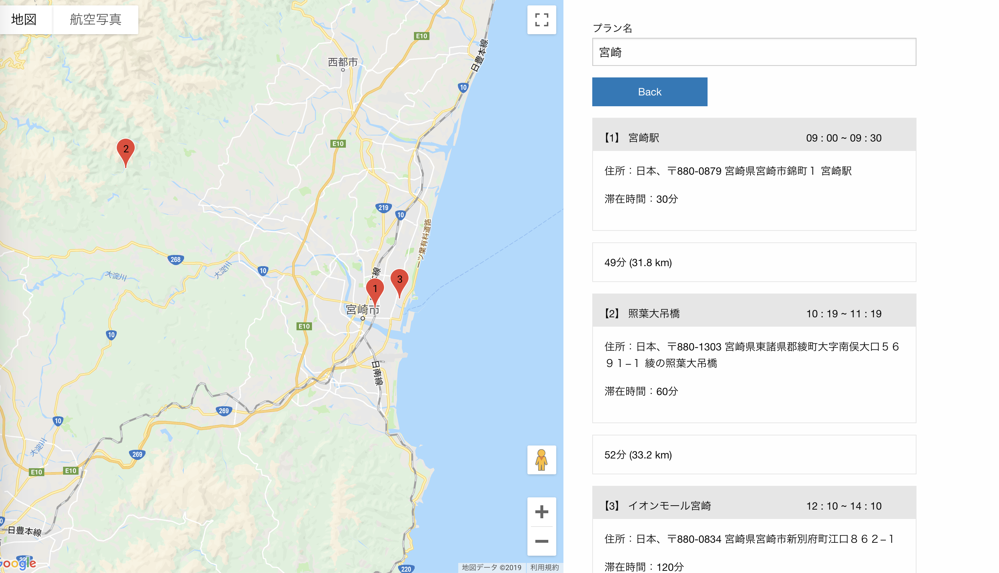

# Travel Plan Map

## Development Environment

### Requrements
* [composer](https://getcomposer.org/download/)
* postgresql

### Database Setting (for Mac OSX)
* cf. postgresql commands
   * https://www.postgresql.org/docs/current/app-psql.html
* Install postgresql
```
brew install postgresql
```
* Start postgresql server
```
pg_ctl -D /usr/local/var/postgres start
```
* Connect database postgres
```
psql postgres
```
* Create table
   * Copy SQL statement from `create_table.sql` and paste to terminal
   * Check database created

```
postgres=# \d
List of relations
Schema|Name|Type|Owner
public|place|table|ayakahidaka
public|place_id_seq|sequence|ayakahidaka
public|plan|table|ayakahidaka
public|plan_id_seq|sequence|ayakahidaka
(4 rows)
```
* Create User

```
create user travel_plan_map_user with password 'xxxx';
grant all on database postgres to travel_plan_map_user;
grant all on table plan to travel_plan_map_user;
grant all on table place to travel_plan_map_user;
grant all on sequence place_id_seq to travel_plan_map_user;
grant all on sequence plan_id_seq to travel_plan_map_user;
```

* Write Database Setting in .env
```
# Database Info
DB_CONNECTION=pgsql
DB_DATABASE=postgres
DB_USERNAME=travel_plan_map_user
DB_PASSWORD=xxxx
``` 


### Serve app
```
php artisan serve
```
Then, visit http://127.0.0.1:8000/

## How to use this app

**Input and Regist Travel Plan**
- Input destination and stay time
- Set start time
- Click "Search" button
- Map with markers and destinations list are displayed
- To regist a plan, input plan name and click "Regist" button
- To edit a plan, click "Edit" button

**View Registerd Plans**
- Click "モデルプラン" tab
- Click on any plan name
- Map with markers and destinations list are displayed

## App URL

https://delicat-maison-22315.herokuapp.com/

## Image


