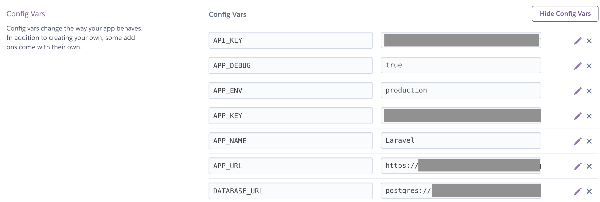

# Travel Plan Map

## Development Environment

### Requrements
* [composer](https://getcomposer.org/download/)
* postgresql

### Install Libraries

* After install composer, execute below command
```
php composer.phar install
```

* If `In PackageManifest.php line 122: Undefined index: name` error occurred, execute below command 

```
php composer.phar update
```

* Generate APP_KEY

```
php artisan key:generate
```

### Environment Variables Setting
* Create `.env`
* [Get Google Map API key](https://developers.google.com/maps/api-key-best-practices)
* Write variables in `.env` (`xxxxx`...Setting Yours)
```
APP_NAME=Laravel
APP_ENV=local
APP_KEY=base64:xxxxx
APP_DEBUG=true
APP_URL=http://localhost
API_KEY=xxxxx # Google Map API key
```

### Serve app
```
php artisan serve
```

* Visit http://127.0.0.1:8000/

### Database Setting (for Mac OSX)
* cf. postgresql commands
   * https://www.postgresql.org/docs/current/app-psql.html
* Install postgresql
```
brew install postgresql
```
* Start postgresql server
```
pg_ctl -D /usr/local/var/postgres start
```
* Connect database postgres
```
psql postgres
```
* Create table
   * Copy SQL statement from `create_table.sql` and paste to terminal
   * Check database created

```
postgres=# \d
List of relations
Schema|Name|Type|Owner
public|place|table|ayakahidaka
public|place_id_seq|sequence|ayakahidaka
public|plan|table|ayakahidaka
public|plan_id_seq|sequence|ayakahidaka
(4 rows)
```
* Create User

```
create user travel_plan_map_user with password 'xxxx';
grant all on database postgres to travel_plan_map_user;
grant all on table plan to travel_plan_map_user;
grant all on table place to travel_plan_map_user;
grant all on sequence place_id_seq to travel_plan_map_user;
grant all on sequence plan_id_seq to travel_plan_map_user;
```

* Write Database Setting in .env
```
# Database Info
DB_CONNECTION=pgsql
DB_DATABASE=postgres
DB_USERNAME=travel_plan_map_user
DB_PASSWORD=xxxx
``` 

## Deployment to Production
* Build js and css
   * Then, created `public/js/app.js` and `public/css/style.css`
```
cd front/
npm run build
```
* Merge js and css in `master` branch
```
git add public/
git commit -m "some message"
```
* Setting heroku
    * Login heroku DashBoard
    * Resource
      * Apply Add-on `Heroku Postgres`
    * Setting
       * Add Buildpack `heroku/php` and `heroku/nodejs`
       * Config Vars ((*)...Setting Yours)
          * `API_KEY` (*)(Google Map API Key)
          * `APP_DEBUG`...`true`
          * `APP_ENV`...`production`
          * `APP_KEY`(*)
          * `APP_NAME`...`Laravel`
          * `APP_URL`(*)
          * `DATABASE_URL`(*)
          * `DB_CONNECTION`...`pgsql`
          * `DB_DATABASE`(*)
          * `DB_HOST`(*)
          * `DB_PASSWORD`(*)
          * `DB_PORT`...`5432`
          * `DB_USERNAME`(*)
          * `LOG_CHANNEL`...`errorlog`



* Push `master` branch to heroku
```
git push heroku master
```


## How to use this app

**Input and Regist Travel Plan**
- Input destination and stay time
- Set start time
- Click "Search" button
- Map with markers and destinations list are displayed
- To regist a plan, input plan name and click "Regist" button

**View Registerd Plans**
- Click "Model Plans" tab
- Click on any plan name
- Map with markers and destinations list are displayed

## App URL

https://delicat-maison-22315.herokuapp.com/

## Image


