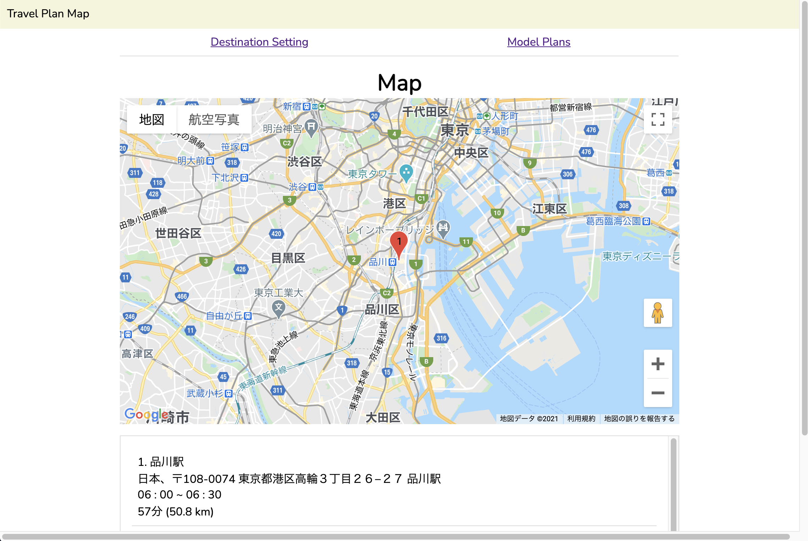

# Travel Plan Map

## Development Environment

### Requrements
* [composer](https://getcomposer.org/download/)

### Serve app
```
php artisan serve
```
Then, visit http://127.0.0.1:8000/

## How to use this app

**Input and Regist Travel Plan**
- Input destination and stay time
- Set start time
- Click "Search" button
- Map with markers and destinations list are displayed
- To regist a plan, input plan name and click "Regist" button
- To edit a plan, click "Edit" button

**View Registerd Plans**
- Click "モデルプラン" tab
- Click on any plan name
- Map with markers and destinations list are displayed

## App URL

https://delicat-maison-22315.herokuapp.com/

## Image


